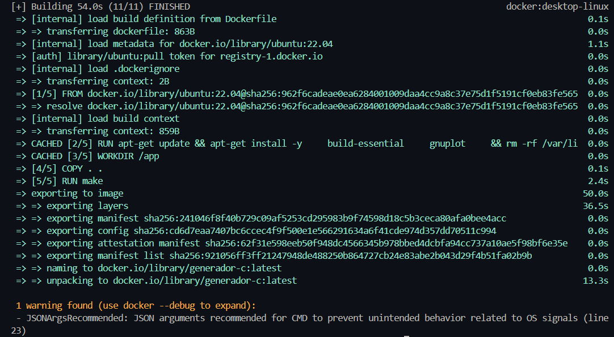
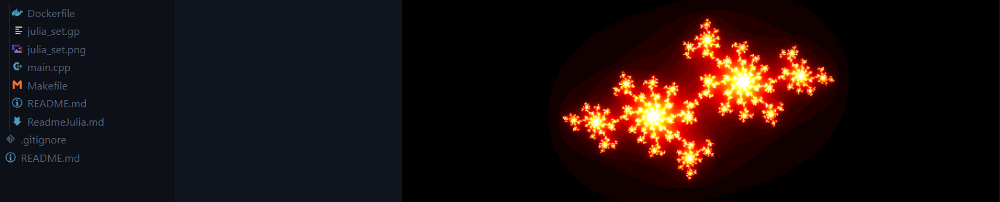
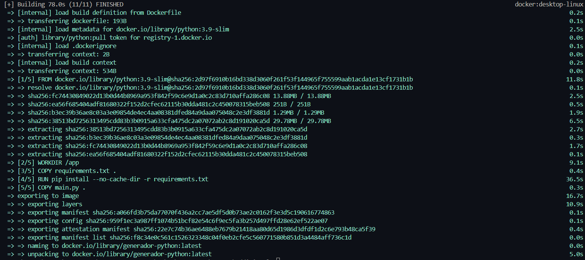
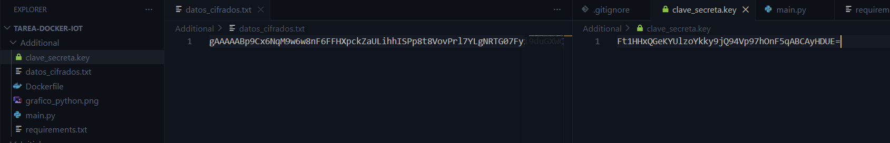

# Uso y Documentación de Contenedores Docker

**Escuela Superior de Cómputo - Instituto Politécnico Nacional**
**Carrera:** Ingeniería en Sistemas Computacionales
**UA:** Internet of Things
**Autor:** Martinez Ortiz Patricia Estefania

---

## 1.- Análisis y documentación del Contenedor Inicial (C / C++)

Este primer contenedor tiene como propósito automatizar la compilación y ejecución de un programa en C++ que calcula y renderiza gráficamente el fractal matemático conocido como "Conjunto de Julia". Utiliza Docker para estandarizar el entorno, asegurando que las librerías gráficas y el compilador operen sin generar conflictos en el sistema host.

### Análisis técnico del Dockerfile

El funcionamiento del código de automatización se basa en los siguientes componentes, garantizando que el proceso esté estandarizado:

* **`FROM ubuntu:22.04`**: Establece un sistema operativo base estable.
* **`RUN apt-get update...`**: Instala las herramientas críticas: `build-essential` (compiladores como GCC/G++) y `gnuplot` (motor de graficación).
* **`WORKDIR` y `COPY`**: Aíslan el espacio de trabajo en `/app` y transfieren el código fuente.
* **`RUN make`**: Delega la compilación a la herramienta automatizada `make`, la cual lee el archivo `Makefile` del repositorio para compilar los objetos y generar el ejecutable.
* **`CMD`**: Secuencia las acciones finales: ejecutar el binario, llamar al script de `gnuplot` para renderizar, y mover el artefacto final (`julia_set.png`) a un directorio de salida.

---

## 2.- Instrucciones de Ejecución

A continuación, se detallan los comandos necesarios para construir y ejecutar los contenedores, extrayendo los artefactos generados hacia el directorio local.

### Contenedor 1: Conjunto de Julia (C++)
1. Abrir la terminal en el directorio `Contenedor_Inicial`.
2. **Construir la imagen:** 
   `docker build -t generador-c .`
3. **Ejecutar y extraer la imagen PNG:** 
   `docker run --rm -v "${PWD}:/resultado" generador-c`

### Contenedor 2: Cifrado de Datos (Python)
1. Abrir la terminal en el directorio `Contenedor_Adicional`.
2. **Construir la imagen:** 
   `docker build -t generador-python .`
3. **Ejecutar y extraer los archivos criptográficos:** 
   `docker run --rm -v "${PWD}:/app" generador-python`

### Reporte de Resultados de Ejecución
Al ejecutar ambos contenedores, la herramienta evalúa las dependencias y compila exitosamente el sistema, reportando los siguientes resultados:
* **Salida Contenedor 1:** Un archivo de imagen `julia_set.png` que representa el fractal matemáticamente generado.
* **Salida Contenedor 2:** Dos archivos extraídos en el host: `clave_secreta.key` (con el token de descifrado) y `datos_cifrados.txt` (con el payload ilegible del sensor IoT).
---
### Evidencias de Ejecución

A continuación, se presentan las capturas de pantalla que demuestran la correcta construcción y ejecución de ambos contenedores, cumpliendo con la extracción de artefactos mediante volúmenes.

#### 1. Contenedor Inicial (C / C++)
**Construcción de la Imagen:**
El registro muestra la instalación exitosa del compilador, las librerías base y `gnuplot` dentro del entorno de Ubuntu.

**Ejecución y Resultado:**
Ejecución del contenedor que compila el código y extrae exitosamente la imagen del Conjunto de Julia (`.png`) al entorno local.

#### 2. Contenedor Adicional (Cifrado Simétrico en Python)
**Construcción de la Imagen:**
Proceso de descarga de la imagen ligera de Python e instalación de la dependencia `cryptography` mediante `pip`.

**Ejecución y Resultado:**
Confirmación del aislamiento del proceso y la extracción exitosa de los artefactos criptográficos (`clave_secreta.key` y `datos_cifrados.txt`) hacia el host.

---
La documentación y análisis del contenedor adicional de Cifrado Simétrico se encuentra en el archivo README.md dentro del directorio /Additional
